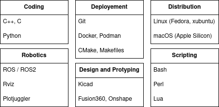

#

## whoami

My name is Elise.

- Robotics apprentice at **CNRS**
- Student at **42 Paris**
- Passionate about embedded systems, autonomous robotics, low-level programming, and machine learning.

## tech stack

You can check some of my Fusion360 work on [ORP](https://openroboticplatform.com/user:ColorGama).

## currently building

### Rampeluche

An autonomous robot featuring:

- 2D LiDAR
- Wi-Fi communication
- IMU integration
- Custom sensor fusion pipeline

## latest work

### Self Driving Car

As part of my work, I implemented a **Pure Pursuit** path-tracking controller in C++ and developed **speed control** algorithms for a robotized [Renault Zoe](https://cristal.univ-lille.fr/pretil/robots/zoe/).

### Learn2Slither

A **reinforcement learning** project based on the classic Snake game.  
Teaching an agent how not to embarrass itself.

### ft_traceroute

A reimplementation of traceroute written from scratch.  
Tracks packet routes across networks and shows what happens between your machine and the destination host.

## interests

- Robotics (quite shocking)
- AI
- Street workout
- Drawing
- Making things move when they shouldn't

## Contact

- LinkedIn:  [https://www.linkedin.com/in/elise-colin-elcolin](https://www.linkedin.com/in/elise-colin-elcolin/)
